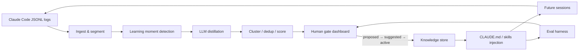

# PRAXIS

**Self-improving knowledge loop for Claude Code agents.**

Claude Code's auto-memory saves a few notes between sessions — but it's an unverified black box: no human approval, no deduplication, no measurement. **PRAXIS** mines the full JSONL session logs the agent already produces, distills durable lessons, runs them through a confidence score and human-approval gate, and injects only promoted knowledge into future sessions — so the agent provably stops relearning the same things and gets better over time.

> **Memory vs. knowledge.** Auto-memory captures scattered, episodic notes. PRAXIS produces generalized, deduplicated, confidence-scored, human-approved, measured knowledge with full provenance.

## The loop

```text
raw logs → extract candidate lessons → consolidate/dedup/generalize → confidence score
         → [human approval gate] → promoted knowledge → injected into future sessions
         → measure improvement → repeat
```



## Problem

Coding agents are less amnesiac than they used to be, but durable knowledge still lives in the gaps:

- **No quality gate** — save decisions are opaque; wrong patterns can be memorized from one-off mistakes.
- **No dedup, decay, or conflict resolution** — stale and contradictory notes coexist indefinitely.
- **No measurement** — nothing verifies a saved memory actually helped a later session.
- **Per-repository only** — nothing carries across projects, models, or domains.
- **Underused raw material** — full JSONL transcripts (`~/.claude/projects/<project>/<session>.jsonl`) record every mistake, correction, and success; auto-memory skims in-flight and discards the rest.

PRAXIS treats that exhaust as a compounding asset.

## MVP scope

| In scope | Out of scope |
|----------|--------------|
| Ingest + segment real Claude Code JSONL logs | Training models from scratch |
| Learning-moment detection (heuristics + LLM) | Hosted SaaS |
| LLM distillation with provenance | Non–Claude-Code agents |
| Cluster/dedup + confidence scoring | Real-time mid-session learning |
| React review dashboard with human gate (`proposed → suggested → active`) | |
| Injection via generated `CLAUDE.md` / skills | |
| Eval harness measuring correction rate before/after | |

**Stretch goals:** trained classifier for learning moments; substrate bake-off (markdown/skills vs. vector RAG vs. knowledge graph); confidence decay and re-verification; contradiction-resolution UI; cross-project knowledge.

## Success criteria

- **Primary metric:** ≥50% fewer user corrections on benchmark tasks vs. cold runs, with no regression in task success rate.
- **Compounding proof:** visible correction-rate curve falling across sessions.
- **Demo outcome:** point PRAXIS at a repo's logs → ranked candidate lessons with evidence in minutes → human promotes the good ones → re-run shows quantified improvement (corrections, failures, tokens, time).

## Team & pillars

Three Gauntlet AI Fellows, each owning one end-to-end pillar for a 9–10 day focused sprint:

| Lead | Pillar | Focus |
|------|--------|-------|
| **Matthew Daw** | ML & Knowledge Pipeline | Ingestion, learning-moment detection, LLM distillation, consolidation/dedup/scoring, knowledge graph, provenance |
| **Monica Peters** | Dashboard & Human Gate | React review dashboard, approval workflow, contradiction resolution UI, credibility metrics, injection controls |
| **Dominic Antonelli** | Architecture, Eval & Integration | System design, eval harness, GitHub hook/PR automation, Python tooling, deployment, compounding-curve proof |

Daily 15-minute syncs; all code reviewed by at least one other member before merge.

## Sprint timeline

| Phase | Days | Milestones |
|-------|------|------------|
| Foundation & design | 1–2 | Architecture, data contracts, dashboard shell, eval skeleton, cold-run baseline |
| Parallel core build | 3–5 | Full pipeline, human-gate UI, scoring/decay, GitHub automation |
| Integration | 6–7 | Dashboard ↔ backend API, injection, eval harness, promotion-to-PR flow |
| Measurement | 8 | Compounding curve, threshold tuning, edge-case polish |
| Demo & handoff | 9–10 | Live demo script, documentation, presentation practice |

## Live demo (3 acts)

1. **Dumb agent** — fresh repo with deliberate quirks; agent stumbles, gets corrected; log captured.
2. **Distillation** — PRAXIS surfaces scored candidates linked to transcript lines; human promotes `suggested → active`.
3. **Smart agent** — sibling task nails quirks first try; side-by-side scoreboard plus compounding curve across a pre-run batch.

## Documentation

| Document | Description |
|----------|-------------|
| [docs/proposal-praxis.md](docs/proposal-praxis.md) | Capstone proposal — problem, direction, technical approach, risks |
| [docs/CONFIDENTIAL_PRAXIS_PROJECT_PLAN.md](docs/CONFIDENTIAL_PRAXIS_PROJECT_PLAN.md) | Team plan, architecture overview, 9-day schedule |
| [docs/Matthew-Daw-ML-Pipeline-PlanDRAFT.md](docs/Matthew-Daw-ML-Pipeline-PlanDRAFT.md) | ML pipeline pillar plan |
| [docs/Monica-Peters-Dashboard-Plan.md](docs/Monica-Peters-Dashboard-Plan.md) | Dashboard & human-gate pillar plan |
| [docs/Dominic-Antonelli-Architecture-Eval-PlanDRAFT.md](docs/Dominic-Antonelli-Architecture-Eval-PlanDRAFT.md) | Architecture, eval & integration pillar plan |
| [docs/monica-wireframes.md](docs/monica-wireframes.md) | Dashboard wireframes and UX notes |
| [docs/PRD.pdf](docs/PRD.pdf) | Product requirements document |
| [docs/proposal-praxis.pdf](docs/proposal-praxis.pdf) | Proposal (PDF export) |

Agent and editor guidance for contributors lives in [`.cursor/rules/`](.cursor/rules/):

- `praxis-shared.mdc` — commits, reviews, TypeScript style, provenance standards
- `praxis-dashboard.mdc` — human-gate UI patterns (Monica's pillar)
- `praxis-pipeline-eval.mdc` — pipeline data contracts, eval harness, integration (Matthew & Dominic)

## Repository layout

The sprint is actively scaffolding the codebase. Expected layout as pillars land:

```text
praxis/
├── docs/                  # Plans, proposal, PRD
├── .cursor/rules/         # Team Cursor rules
├── pipeline/              # Python: ingest, detect, distill, score (Matthew)
├── dashboard/             # React human-gate UI (Monica)
├── eval/                  # Harness, quirky benchmark repo, metrics (Dominic)
└── README.md
```

Installation and run instructions will be added here as each pillar merges its foundation (Days 1–2 deliverables).

## Contributing

- Use [conventional commits](https://www.conventionalcommits.org/) (`feat`, `fix`, `chore`, `docs`, `refactor`, `test`) with `#<issue>` references.
- Open small, focused merge requests with clear descriptions; at least one peer review required before merge.
- Preserve **provenance** on every candidate/lesson object (source log path + line offset) in code and UI.
- All code must pass lint and type checks before review.

## License

TBD — Gauntlet AI capstone project (2026).
