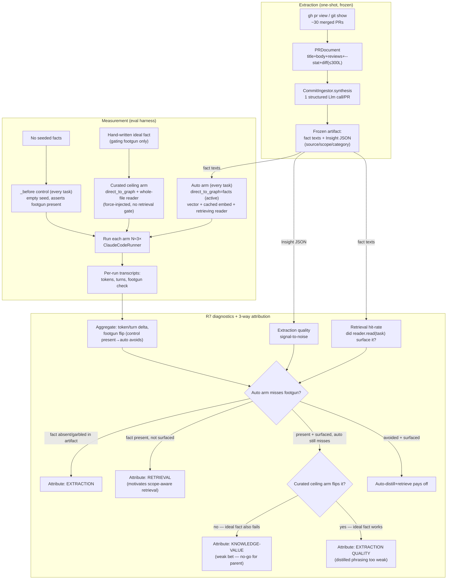

# feat: PR-knowledge auto-distill slice

## Summary

Build the first slice that resembles the parent proposal's real shape: a minimal `CommitIngestor`
that distills durable engineering knowledge from merged Praxis PRs with **one LLM call each**, freezes
the distilled facts as a committed artifact, seeds them as `active` facts, and lets a coding agent
consume them through the existing **semantic retrieval** path (the `RetrievingReader` — the same
ranking the MCP `praxis_get_context` backend uses). It then re-runs a small seeded-footgun task set
on the existing `ClaudeCodeRunner` harness. Every task compares **two arms** — no-facts vs.
auto-distilled+retrieved — on token/turn and footgun-avoidance; the **gating footgun task adds a third
curated ceiling arm** (the hand-written ideal fact, force-injected) so a flat result can be
disambiguated. Two R7 diagnostics (extraction quality, retrieval hit-rate) plus that ceiling make any
shortfall attributable across three causes: **extraction**, **retrieval**, or **knowledge-value**.

**Built independently of the dogfood experiment** (per direction): this slice stands up its own task
set, seeded footgun, and frozen fact artifact rather than consuming the dogfood experiment's
curated+pushed baseline. The full multi-task curated baseline stays dropped; a **footgun-only curated
ceiling arm** is recreated cheaply (the ideal fact text is already known) so the experiment can tell
*the knowledge has no value* apart from *auto-distillation lost the value curation would keep* — the
question a 2-arm-only design cannot answer.

> **Revision (2026-06-24) — footgun set re-grounded on the dogfood v2 run.** The original draft used
> `umap_neighbors` + `phoenix_tracing` as the two gating footguns. The now-completed dogfood experiment
> (`knowledge/evals/cases/dom/pr_knowledge_dogfood/`) tested exactly those constructs and found both
> wanting: **`phoenix_tracing`'s control never exhibited the footgun (0/3) — dropped**; **`umap_neighbors`
> is variance-prone (control 2/3 → 0/3 across runs) — demoted to a non-gating cost signal**. The one
> construct it validated as reliably blind-tempting is **`yoyo_lazy_import`** (control 3/3, clean flip),
> which is now the **gating** footgun. Net: gate on `yoyo`, keep `umap` for its (non-gating) token/turn
> cost signal, drop `phoenix`. This leaves a single gating footgun — thinner than the ≥2 the dogfood
> lesson recommends — so U6 reports any GO as **provisional** (see Risks).

---

## Problem Frame

The parent proposal bets that knowledge from merged PRs helps coding agents work faster, cheaper, and
better in the repo. Two questions sit between that bet and a real pipeline (see
[origin](../proposals/2026-06-24-pr-knowledge-auto-distill-slice.md)):

1. **Extraction** — can one cheap LLM call pull facts of real value out of a PR automatically?
2. **Retrieval** — does the existing semantic-similarity path actually surface the right fact at the
   right moment, or does the agent never see it?

This slice tests both at once. It is the first point at which the parent proposal's **retrieval gap**
(semantic-only retrieval, no file/scope awareness) can actually bite — and observing it bite, cleanly
attributed, is part of the point. Retrieval is deliberately left **unchanged** so a retrieval
shortfall is *observable and attributable* rather than masked by a fix.

---

## Requirements

Carried from the origin proposal (R1–R7), refined for the **independent build** confirmed in planning
(2-arm everywhere + a footgun-only curated ceiling arm + R7 diagnostics).

**Extraction**

- R1. A minimal `CommitIngestor` variant alongside `PromptIngestor`. Input = a merged PR (title, body,
  review threads, condensed diff); output = `Insight[]` via **one** specialized structured LLM
  distillation call. Each insight carries `source = "git/pr:<n>"` (or `"git/commit:<sha>"` for the
  commit-fallback unit), a distiller-chosen `scope`, and a `category`.
- R2. The distillation prompt targets durable knowledge (decisions, gotchas, conventions, rejected
  approaches) and ignores churn, renames, and version bumps.
- R3. Backfill the **last ~30** merged Praxis PRs through the ingestor (decided in planning).

**Storage & retrieval**

- R4. Distilled facts are written as `active` facts in the graph via the existing write path — no
  contradiction/supersession logic.
- R5. The agent consumes facts through the existing **semantic retrieval** seam, **unchanged** — no
  scope-aware / file-aware enhancements in this slice. The harness's `RetrievingReader` models the
  **ranked retrieval lane**: the backend's `/context` (behind MCP `praxis_get_context`) returns both a
  ranked `hits` list (`graph.search`, cosine, `active`-only — what `RetrievingReader` mirrors) **and**
  an unranked `context` string (the endpoint builds `build_trio(..., reader="whole_file")` by default,
  so `context` is the whole active graph — see `knowledge/serve/app.py` `get_context` and
  `knowledge/wiring.py` `build_trio`). This slice measures the **ranked lane** deliberately, because
  that is where a retrieval shortfall is observable (R7); the unranked `context` dump cannot starve the
  agent of a present fact and so cannot exhibit the gap. A manual MCP smoke check confirms the facts
  are consumable end-to-end — it is **not** treated as proof that the two paths are equivalent.

**Measurement**

- R6. Re-run a small seeded task set (including the seeded footgun) and compare the
  **auto-distilled+retrieved** arm against the **no-facts** arm on token/turn and footgun-avoidance,
  eyeballed across ~3 trials per arm (no fixed percentage threshold). The gating footgun task additionally
  runs a **curated ceiling arm** — the hand-written ideal fact, force-injected via the whole-file reader
  (no retrieval gate, dogfood-style "curated+pushed") — to bound how much of any shortfall is
  curation-vs-extraction.
- R7. Capture two diagnostic signals: **extraction quality** (signal-to-noise of the frozen distilled
  facts) and **retrieval hit-rate** (did the relevant fact surface in `reader.read(task)` for each
  task, especially the seeded one?). A shortfall is attributed three ways: **extraction** (fact
  missing/garbled from the artifact), **retrieval** (fact present in the artifact but unsurfaced by the
  reader — the concrete motivation for the parent proposal's two-lane scope-aware retrieval), or
  **knowledge-value** (fact present *and* surfaced *and* the curated ceiling arm *also* fails to move
  the metric — the bet is weak, which the unrun dogfood gate would have caught). When the curated arm
  succeeds where auto fails on a present+surfaced fact, the gap is **extraction quality** (the distilled
  phrasing was weaker than the ideal).

---

## Key Technical Decisions

- **Structured `Llm` seam, not the `PromptIngestor` text seam.** `PromptIngestor` uses a text-only
  `LLM = Callable[[str], str]` and post-splits lines. A single structured distill that emits
  `{raw_text, scope, category}` per fact needs the full `Llm.complete(messages, response_format=...)`
  contract. Mirror the canonical structured-call pattern in
  `knowledge/knowledge_graph/write_policy/write_step_variants/claim_extractor.py` (`ClaimExtractionJudge`:
  `json_schema` `strict` response_format → `json.loads` → drop-malformed precision-first). As of the
  latest main, `knowledge/injestion/dump_ingest.py` (`_distill`) is an even closer exemplar — one
  `llm.complete(response_format=_DISTILL_SCHEMA)` call returning a per-fact structured array — mirror its
  *call shape* (not its slot-dedup/conflict reconciliation). `CommitIngestor` takes an injected `Llm`
  object.

- **Freeze the distilled facts; keep distillation out of the eval loop.** Backfill runs the ingestor
  over ~30 PRs **once** and commits its output as a fixture. Eval cases seed those frozen fact texts
  via `seeded_insight.direct_to_graph` (active), **not** `via_ingestor` (which would re-distill each
  run). gpt-4o-mini is not byte-stable even at temp 0 (see
  `docs/proposals/completed/2026-06-22-deterministic-ingestion-cassette.md`), so re-distilling in the
  loop would make the graph the agent reads irreproducible. Freezing sidesteps the distill-cassette
  problem entirely; the only replay layer the eval needs is the existing embedding cache
  (`CachedEmbedder`), which is deterministic per `(model, text)`. (Latest main added
  `knowledge/llm/llm_cassette.py`, a cassette over structured `Llm.complete`, so an in-loop distill
  variant *would* now be replayable — freezing is still the simpler choice here.)

- **Provenance lives in the frozen artifact, not the store.** The latest `Ingestor.ingest` (updated in
  main) now threads `source` into `graph.write(..., source=source)`, but `scope`/`category` still
  aren't, and this slice's eval path seeds frozen facts via `direct_to_graph` (text-only
  `graph.write(text, state="active")`) for determinism — so the store carries only the fact *text*
  either way. The full `Insight` metadata (source/scope/category) is captured in the committed backfill
  artifact, where R7's extraction-quality and "would scope-routing have helped" diagnostics read it.
  **No write-contract widening in this slice** — full scope/category persistence is a prerequisite the
  *next* (scope-aware retrieval) slice owns.

- **Retrieving reader, not whole-file.** The dogfood plan deliberately used the whole-file reader to
  remove retrieval as a variable. This slice does the opposite: it uses `RetrievingReader`
  (`substrate: vector`, `embedder: cached`, `reader: retrieving`, `ingest_state: active`) precisely so
  retrieval *can* fall short and R7 can attribute it. This is the matt/applications combination minus
  the in-loop `via_ingestor` distill. **Caveat on the MCP path:** the backend `/context` endpoint
  builds the trio with the default `reader="whole_file"`, so its `context` string is unranked; only its
  `hits` list is ranked. The `RetrievingReader` arm therefore models the *ranked* lane (the `hits`
  ranking + the forward-looking retrieval seam), **not** today's unranked `context` dump — the plan
  must not claim they are equivalent. Making the MCP `context` string itself ranked is a one-line
  `reader="retrieving"` change to the `/context` `build_trio` call, explicitly out of scope here.

- **Diff summarization: high-precision, bounded.** Full diffs are too large to feed raw. Per PR, feed
  the distiller: title + body + review-thread comments + `--stat` (files changed) + a **truncated**
  unified diff capped at ~300 lines, de-prioritizing test/lockfile/generated hunks. This matches the
  parent proposal's "PR-descriptions-and-reviews-first" precision bias; the footgun example commits
  (`1fdb8be` yoyo lazy-import, `d892e88` UMAP) are well-described in body + small diffs, so the cap
  rarely bites.

- **Backfill unit: PR-primary, commit-fallback.** `gh pr view` is the primary fetch. Recent
  high-signal history (`d892e88`, `22db05f`) landed as **single-parent commits with extractable
  diffs** (direct or squash-PR), not 2-parent merge commits, so the ingestor also accepts a commit
  unit (`git show`) with `source = "git/commit:<sha>"`. The seeded
  footgun facts are sourced this way to guarantee they're in the frozen set.

- **Before/after convention; three arms on the gating footgun task.** Each task is a paired set: a treatment
  case (base name, `direct_to_graph` = frozen facts, retrieving reader) and a `_before` control (empty
  `seeded_insight`), identical `seed_prompt`. The control proves the test is sensitive — following the
  repo's working empty-seed convention (`pathlib_preference_before`), the control **asserts the
  blind-default pattern is present** (a positive PASS check on the footgun), rather than relying on an
  `xfail`-failing check, so agent nondeterminism can't quietly XPASS the control into a meaningless
  green. The gate is directional token/turn reduction **and** the gating footgun's flip (`yoyo`).
- **Footgun-only curated ceiling arm.** The gating footgun task (`yoyo_lazy_import`) adds a third
  sibling case (`yoyo_lazy_import_curated`) that seeds the **hand-written ideal fact** via
  `direct_to_graph` and reads it through the **whole-file reader** (`reader: whole_file` —
  force-injected, no retrieval gate), so the agent is *guaranteed* to see the perfect fact. This is the
  dogfood experiment's "curated+pushed" arm, scoped to the one gating footgun task only (the full
  multi-task curated baseline stays deferred). It is near-free: the ideal fact text is the same
  lazy-import neutralizing fact (#9 in the dogfood `facts.md`) U3 sources from `1fdb8be`. Its purpose is
  to recover the disambiguation a 2-arm design loses: with no curated ceiling, a flat result cannot tell
  *the knowledge has no value* (which the unrun dogfood gate would have caught) from *auto-distillation
  is too lossy to keep the value curation would*. The curated arm resolves that — if the force-injected
  ideal fact *also* fails to flip the footgun, the cause is **knowledge-value** (a no-go for the parent
  bet, not a build-more-pipeline signal); if it flips where auto doesn't, the gap is **extraction
  quality**. U6's RESULTS.md still reports any GO as **provisional**, since the curated ceiling validates
  only the one gating footgun fact, not the bet across the repo.

---

## High-Level Technical Design

The slice is a one-shot extraction backfill feeding a frozen fact artifact, consumed by a two-arm A/B
over semantic retrieval (plus a curated ceiling arm on the gating footgun task), with a diagnostics pass
that attributes any shortfall three ways:



The diagram is authoritative for the data flow and the three-way attribution branch (the slice's core
finding); prose governs any disagreement.

---

## Output Structure

New files cluster in two places: the ingestor surface and a new eval suite folder.

```text
knowledge/injestion/
  pr_source.py                         # U1: gh/git fetch + diff summarization → PRDocument
  injestor_variants/
    commit_injestor.py                 # U2: CommitIngestor (structured single-call distiller)
  backfill_prs.py                      # U3: one-shot backfill → frozen artifact
  tests/
    test_pr_source.py                  # U1
    test_commit_injestor.py            # U2
    test_backfill_prs.py               # U3

knowledge/evals/cases/dom/pr_knowledge_autodistill/
  README.md                            # U4: task set, footguns, blind-defaults, preventing facts
  facts.frozen.txt                     # U3 output: distilled fact texts (seed source)
  facts.insights.json                  # U3 output: full Insight metadata (R7 extraction diagnostics)
  yoyo_lazy_import/case.yaml           # U4: auto arm (GATING footgun — validated by dogfood v2)
  yoyo_lazy_import_before/case.yaml    # U4: control (asserts footgun present)
  yoyo_lazy_import_curated/case.yaml   # U4: curated ceiling (ideal fact, whole-file reader)
  umap_neighbors/case.yaml             # U4: auto arm (demoted: non-gating cost signal, no curated arm)
  umap_neighbors_before/case.yaml      # U4: control (records footgun, non-gating)
  <convention_task>/case.yaml          # U4: 1 non-footgun quantitative task (+ _before; no curated arm)
  analyze.py                           # U5: trial aggregation + R7 diagnostics
  tests/test_analyze.py                # U5
  RESULTS.md                           # U6: findings + attribution + next-increment call
```

The per-unit **Files** sections remain authoritative; the tree is a scope sketch the implementer may
adjust (e.g. folding `backfill_prs.py` under the suite folder).

---

## Implementation Units

### U1. PR fetch + diff-summarization module

- **Goal:** Turn a merged PR (or a commit) into a compact, distiller-ready `PRDocument` text:
  title + body + review-thread comments + `--stat` + a truncated unified diff. Provide a backfill
  helper that lists the last N merged PRs.
- **Requirements:** R1 (input assembly), R3 (last-N listing).
- **Dependencies:** none.
- **Files:** `knowledge/injestion/pr_source.py`, `knowledge/injestion/tests/test_pr_source.py`.
- **Approach:** A small module with a `PRDocument` model (`number`/`sha`, `title`, `body`,
  `reviews`, `diff_summary`, `unit_source` = `git/pr:<n>` | `git/commit:<sha>`) and pure builder
  functions. Use a plain dataclass unless the `gh pr view --json` output is validated directly into the
  model (then Pydantic `model_validate` earns its keep) — it has one in-module consumer (U2), so don't
  reach for Pydantic by default. **Inject the fetcher** (a `Callable` wrapping `gh pr view --json ...` / `gh pr list` /
  `git show`) so tests run offline against fixture JSON and never shell out. Diff truncation: cap at
  ~300 lines, drop hunks under `tests/`, `*.lock`, and generated paths first; record that truncation
  happened. `gh` requires auth (`gh auth login` / `GH_TOKEN`) — that's a backfill prerequisite, not a
  test dependency.
- **Patterns to follow:** the variant/`_def` split and `from __future__ import annotations` house
  style; Pydantic models as in `knowledge/injestion/injestion_def.py`; injected-callable-for-offline
  pattern as in `ClaudeCodeRunner.run_cli` (`knowledge/evals/claude_code.py`).
- **Test scenarios:**
  - Happy path: a fixture PR JSON (title, body, 2 review comments, a 40-line diff) assembles a
    `PRDocument` whose text contains the body, both review comments, the `--stat`, and the diff.
  - Covers R1. `unit_source` is `git/pr:<n>` for a PR input and `git/commit:<sha>` for a commit input.
  - Diff cap: a 1,000-line diff truncates to ~300 lines, prefers non-test hunks, and flags truncation.
  - Edge: a PR with no review threads assembles cleanly (no empty "Reviews:" noise).
  - Edge: `gh pr list` returns last-N **merged** only; an open/draft PR in the fixture is excluded.
  - Error: a non-zero fetcher exit surfaces as a raised error, not a silent empty document.

### U2. CommitIngestor variant + distillation prompt

- **Goal:** A new `Ingestor` variant that distills one `PRDocument` into `Insight[]` with **one**
  structured LLM call, each insight carrying `raw_text`, `source`, `scope`, `category`.
- **Requirements:** R1, R2.
- **Dependencies:** U1 (`PRDocument` shape).
- **Files:** `knowledge/injestion/injestor_variants/commit_injestor.py`,
  `knowledge/injestion/tests/test_commit_injestor.py`.
- **Approach:** Subclass `Ingestor`; override `synthesis(raw_input, *, source=None)` to call
  `self.llm.complete([ChatMessage(role="user", content=prompt)], response_format=_SCHEMA)` and parse a
  `{"insights": [{text, scope, category}, ...]}` payload into `Insight` objects, stamping `source` from
  the `PRDocument.unit_source`. The current `Ingestor.synthesis(raw_input: str, *, source: str | None =
  None)` signature (updated in main) already carries `source`, so `CommitIngestor.synthesis` takes the
  rendered `PRDocument` text plus `source=unit_source` directly — no construction-time threading or
  signature-widening needed (`knowledge/injestion/parent_injestor.py`). U3 calls `synthesis` directly
  (not `ingest`). The prompt (R2) instructs: extract only durable engineering knowledge
  (decisions, gotchas, conventions, rejected approaches); ignore churn, renames, version bumps,
  formatting; choose `scope` from the small vocabulary (`file:<path>` / `module:<name>` / `repo`) and
  `category` from `decision|gotcha|convention|rejected`; return `[]` when nothing durable is present.
  Precision-first: drop malformed entries rather than failing the whole PR. Takes the full `Llm`
  object (KTD), not the text-only seam.
- **Technical design (directional, not spec):** the `_SCHEMA` shape and drop-malformed loop mirror
  `dump_ingest._distill` (`knowledge/injestion/dump_ingest.py`, landed in main — one structured
  `llm.complete(response_format=_DISTILL_SCHEMA)` call → per-fact array) and `ClaimExtractionJudge._compute`
  (`knowledge/knowledge_graph/write_policy/write_step_variants/claim_extractor.py`). Mirror the call
  shape only — do not adopt `ingest_dump`'s slot-dedup / auto-supersede conflict reconciliation (R4
  excludes contradiction/supersession logic; and it is the wrong
  reconciliation mode here).
- **Patterns to follow:** `dump_ingest._distill` (structured single `Llm.complete` call → per-fact
  array — the closest exemplar, in main); `ClaimExtractionJudge` (structured call + json.loads +
  precision-first); `PromptIngestor` (variant subclassing `Ingestor`, overriding only `synthesis`).
- **Execution note:** Implement new domain behavior test-first against a scripted/fake LLM.
- **Test scenarios:**
  - Covers R1. A structured response with two insights → two `Insight`s with `source="git/pr:<n>"`,
    populated `scope` and `category`, and the expected `raw_text`.
  - Covers R2. A `PRDocument` that is purely a version bump / rename → `synthesis` returns `[]`
    (churn ignored); a doc with a documented gotcha → an insight with `category="gotcha"`.
  - Edge: malformed entry in the array (missing `text`) is dropped, the well-formed siblings survive,
    no exception.
  - Edge: empty/whitespace LLM response → `[]`, not a crash.
  - Offline: runs against a scripted fake `Llm` (deterministic) with no network.

### U3. Backfill entrypoint → frozen distilled-facts artifact

- **Goal:** A one-shot runnable that fetches the last ~30 merged PRs (plus the named footgun commits),
  distills each, and writes two committed artifacts: `facts.frozen.txt` (fact texts, the seed source)
  and `facts.insights.json` (full `Insight` metadata for R7).
- **Requirements:** R1, R3, R4 (produces the `active`-ready fact set).
- **Dependencies:** U1, U2.
- **Files:** `knowledge/injestion/backfill_prs.py`,
  `knowledge/injestion/tests/test_backfill_prs.py`, the committed outputs under
  `knowledge/evals/cases/dom/pr_knowledge_autodistill/` (`facts.frozen.txt`, `facts.insights.json`),
  and the refreshed embedding-cache fixture
  (`knowledge/evals/fixtures/embeddings/openai_text-embedding-3-small.json`).
- **Approach:** Compose U1's fetcher + U2's ingestor. Iterate PRs/commits, accumulate `Insight`s,
  de-duplicate exact-text repeats, and serialize both artifacts deterministically (stable ordering).
  The **live** run (real `gh` + real LLM) is a manual one-shot the implementer executes once to
  produce the committed fixtures (KTD: freeze, keep distillation out of the eval loop). **Then refresh
  the embedding cache for the frozen fact texts**: every new fact text is a guaranteed cache miss, and
  `CachedEmbedder.embed` raises on a miss when no API key is present
  (`knowledge/llm/embedder_variants/cached_embedder.py`), so without committed vectors the U4 treatment
  cases and the retrieval probe error out offline. Mirror the existing `knowledge/evals/embed_cache
  --refresh` step and commit the updated cache. Guarantee the footgun-neutralizing facts are present
  (source them from `d892e88` / `22db05f` explicitly).
- **Patterns to follow:** the `sources/` + `_generate.py` "stamp once, commit" pattern in
  `knowledge/evals/cases/matt/applications/`.
- **Execution note:** The live backfill needs `gh auth login` and `OPENROUTER_API_KEY` and is run
  once; the committed artifacts are what the suite and tests depend on thereafter.
- **Test scenarios:**
  - Happy path: given a fake fetcher (3 fixture PRDocuments) + scripted distill, produces the expected
    fact texts in `facts.frozen.txt` and the matching `Insight` records in `facts.insights.json`.
  - Covers R3. Listing caps at N (≈30); requesting more PRs than exist stops cleanly.
  - Edge: a PR that distills to `[]` contributes nothing and does not error.
  - Determinism: same inputs → byte-identical artifacts (stable ordering/dedup).

### U4. Seeded-footgun task set + paired arm cases (retrieving reader)

- **Goal:** Author the eval suite: a README plus, per task, an **auto** case (frozen facts via
  `direct_to_graph`, retrieving reader over a vector substrate) and a `_before` control (empty seed);
  the **gating footgun task** (`yoyo_lazy_import`) additionally gets a `_curated` ceiling case (the
  hand-written ideal fact, whole-file reader). The footgun deterministic check runs on all three arms of
  the gating task and on both arms of the demoted `umap` cost task.
- **Requirements:** R4, R5, R6 (footgun-avoidance + curated ceiling), R7 (retrieval-hit surface).
- **Dependencies:** U3 (frozen facts must exist).
- **Files:** `knowledge/evals/cases/dom/pr_knowledge_autodistill/README.md`;
  `yoyo_lazy_import/case.yaml` + `yoyo_lazy_import_before/case.yaml` + `yoyo_lazy_import_curated/case.yaml`
  (the gating footgun, three arms); `umap_neighbors/case.yaml` + `umap_neighbors_before/case.yaml`
  (demoted to a non-gating cost signal — two arms, no curated ceiling); 1 `<convention_task>/case.yaml`
  (+ `_before`, no curated arm); fixtures under each case's `fixtures/`; a custom deterministic check
  only if the footgun can't be expressed as a regex present/absent pair (the gating `yoyo` check
  already is — see below).
- **Approach:** The **auto** arm carries `seeded_insight.direct_to_graph` = the frozen fact texts,
  `substrate: vector`, `embedder: cached`, `reader: retrieving`, `ingest_state: active`. The **control**
  leaves `seeded_insight` empty (asserts the footgun is present blind). The **curated ceiling** seeds a
  single `direct_to_graph` ideal fact and uses `reader: whole_file` so it is force-injected with no
  retrieval cutoff — guaranteeing the agent sees the perfect fact, which isolates knowledge-value from
  extraction/retrieval. All three share an identical `seed_prompt`; only the seed + reader differ.
  Footgun design (grounded in the dogfood v2 run — see the revision note above):
  - **`yoyo_lazy_import`** (`1fdb8be` / #48) — **the gating footgun.** This is the one construct the
    dogfood experiment validated as reliably blind-tempting (control exhibited it **3/3**, treatment
    avoided **3/3**, clean flip). Task: ask the agent to write a yoyo migration
    (`0002_backfill_fact_source.py`) that backfills a column by calling into a `knowledge....` module.
    yoyo execs migration files with the repo root **off `sys.path`**, so the universal Python instinct —
    a top-level `from knowledge...` import — raises `ModuleNotFoundError` before the step runs; the fact
    says import `knowledge` lazily inside the step. Check pair (proven in the dogfood suite): the control
    asserts a column-0 `^(?:from|import)\s+knowledge\b` is **present** (`text:regex_matches`); the auto +
    curated arms assert it is **absent** (`text:regex_absent`). **Copy the built dogfood case verbatim** —
    `knowledge/evals/cases/dom/pr_knowledge_dogfood/yoyo_lazy_import{,_before}/case.yaml` — changing only
    the seed source (frozen distilled facts + retrieving reader on the auto arm; the single ideal fact #9
    + whole-file reader on the curated arm). It mounts **no** `fixtures/` (it is a pure create-task), so
    it is the simplest arm to stand up first.
  - **`umap_neighbors`** (`d892e88` / #57) — **demoted to a non-gating cost signal (two arms, no curated
    ceiling).** Fixture is a small clustering module exposing `n_neighbors`; task asks the agent to fix
    "topics collapse into one giant blob." The intuitive blind move is to **raise** `n_neighbors`
    (backwards); the fact says keep it low. Keep the auto + `_before` arms and record the footgun
    present/absent check, but **do not gate on its flip**: the dogfood run showed its control is
    variance-prone (exhibited the footgun 2/3 in v1, **0/3** in v2 — at n≈3 the flip is a coin-flip). It
    earns its place on the **token/turn cost signal** (the blind control flailed far more even when it
    eventually reached the one-line fix), not on footgun-avoidance.
  Set `needs: [sandbox, file_io]` so only `ClaudeCodeRunner` serves them. Scope each content check to
  the case `output_file` so the box-sweep doesn't grade the mounted fixture itself. **No existing case
  combines a mounted sandbox `fixtures/` code module with a retrieving/vector reader** (the
  matt/applications cases mount no fixture; the `reader_cutoff` cases are reader-only) — so author the
  `yoyo_lazy_import` auto-arm case end-to-end first (it mounts no `fixtures/`, so it isolates the
  seed → embed → retrieve → grade path), confirm that path runs, then author `umap_neighbors` (which adds
  a mounted `fixtures/` clustering module) and the convention task.
- **Patterns to follow:** the **built** dogfood suite `knowledge/evals/cases/dom/pr_knowledge_dogfood/`
  — copy `yoyo_lazy_import{,_before}/case.yaml` directly (it is the validated footgun) and follow its
  README's footgun-validity discipline;
  `knowledge/evals/cases/dom/reader_cutoff/lost_in_middle_reader{,_before}/` for the retrieving-reader
  + `_before` pairing; `pathlib_preference{,_before}` for the empty-seed cold baseline;
  `_generate.py` in matt/applications for case authoring; case schema in `knowledge/evals/eval_def.py`.
- **Execution note:** Confirm each `_before` control genuinely **exhibits** the footgun blind (the
  control's positive check passes) before trusting the auto arm's avoidance — a control that avoids
  the footgun blind proves nothing (measurement validity); the dogfood run already validated this for
  `yoyo` (3/3), so re-confirm rather than re-discover. To keep the retrieval signal from being
  author-tuned, **freeze the distilled fact text first, then write the task prompt from the natural
  user symptom**, not from the fact's vocabulary — so retrieval similarity is earned, not engineered.
- **Test scenarios:**
  - Covers R6/R7. Gating footgun control (`yoyo_lazy_import_before`): no facts → agent writes a
    top-level `from knowledge...` import → the control's positive check (column-0
    `^(?:from|import)\s+knowledge\b` **present**, `text:regex_matches`) passes, proving the task is
    sensitive (validated 3/3 in dogfood v2).
  - Covers R6/R7. Auto arm (`yoyo_lazy_import`): facts retrieved → agent defers the `knowledge` import
    inside the step → the footgun-absence check (`text:regex_absent`, same pattern) passes → PASS.
  - Covers R6/R7. Curated ceiling (`yoyo_lazy_import_curated`): ideal fact (#9, lazy-import)
    force-injected via whole-file reader → agent defers the import → absence check passes. (If this arm
    *fails*, the knowledge itself doesn't help — a knowledge-value no-go, not an extraction/retrieval gap.)
  - Covers R6 (non-gating). Cost-signal task (`umap_neighbors` + `_before`): two arms only. Record the
    `n_neighbors`-raised footgun check for diagnostic interest, but the verdict reads its **token/turn
    delta**, not its flip (the flip is non-gating — see Approach).
  - Covers R7. Retrieval probe: for each auto-arm task, `reader.read(seed_prompt)` over the seeded
    graph contains the neutralizing fact's text (the hit-rate signal U5 consumes); record the fact's
    cosine score against the query so a pass is distinguishable from a near-trivial lexical match.
  - Both arms produce non-empty output (`builds:output_nonempty`) so a crash isn't read as a result.
  - Non-footgun convention task: a produced-output check on both arms (carries the quantitative
    token/turn signal, not a footgun assertion).

### U5. Measurement + R7 diagnostics tooling

- **Goal:** Run each case N≈3× per arm (auto, control, and the curated ceiling on the gating footgun task),
  aggregate token/turn deltas and footgun flips, and emit the two R7 diagnostics with three-way
  attribution.
- **Requirements:** R6, R7.
- **Dependencies:** U3 (artifacts), U4 (cases).
- **Files:** `knowledge/evals/cases/dom/pr_knowledge_autodistill/analyze.py`,
  `knowledge/evals/cases/dom/pr_knowledge_autodistill/tests/test_analyze.py`.
- **Approach:** Loop `python -m knowledge.evals.run <case_id>` N times per case (or a minimal
  `--trials` flag — decide in implementation), parse per-run usage from transcripts per
  `_claude_usage()` shape (`input_tokens`/`output_tokens`/`num_turns`), and report per-task per-arm
  mean ± spread + delta direction + footgun outcome. **Extraction-quality** diagnostic: summarize
  `facts.insights.json` signal-to-noise (count, category mix, and — for each footgun — whether a
  neutralizing fact is present at all). **Retrieval hit-rate** diagnostic: for each task, report
  whether the neutralizing fact surfaced in the auto arm's `reader.read(seed_prompt)`. **Three-way
  attribution** when the auto arm misses a footgun: fact absent/garbled in the artifact ⇒ EXTRACTION;
  fact present in artifact but not surfaced by the reader ⇒ RETRIEVAL (the finding that motivates
  two-lane scope-aware retrieval); fact present **and** surfaced ⇒ consult the curated ceiling arm —
  if curated also misses the footgun ⇒ KNOWLEDGE-VALUE (the bet is weak), if curated flips it ⇒
  EXTRACTION-QUALITY (the distilled phrasing was weaker than the ideal fact).
- **Patterns to follow:** transcript shape + usage extraction in `knowledge/evals/claude_code.py`
  (`_claude_usage`, `tracing.record_output`); the **built** dogfood suite's
  `knowledge/evals/cases/dom/pr_knowledge_dogfood/analyze.py` (+ its `test_analyze.py`) for the
  trial-loop + cost-to-correct aggregation + go-gate shape. **Reuse decision — now resolved (the dogfood
  suite has landed):** the trial-loop + transcript-parse + per-arm-delta core already exists in that
  `analyze.py`. Factor the shared core into `knowledge/evals/analyze_utils.py`, refactor the dogfood
  `analyze.py` to consume it, and scope U5 to the R7 attribution layer on top — so the core isn't built
  (or maintained) twice. (Note the metric difference: the dogfood gate is **cost-to-correct**
  [control first-pass + rework vs. treatment]; this slice's gate is the two-arm token/turn delta +
  footgun flip — the shared core is the trial loop and usage parsing, not the gate logic.)
- **Test scenarios:**
  - Happy path: fixture transcripts for both arms → correct per-arm token/turn means and delta
    direction.
  - Footgun flip: failing control transcript + passing treatment transcript → flip reported satisfied.
  - Attribution — retrieval: neutralizing fact in `facts.insights.json` but absent from the recorded
    reader output → attribution = RETRIEVAL.
  - Attribution — extraction: neutralizing fact absent from `facts.insights.json` → attribution =
    EXTRACTION.
  - Attribution — knowledge-value: fact present + surfaced, auto misses **and** curated arm misses →
    attribution = KNOWLEDGE-VALUE.
  - Attribution — extraction-quality: fact present + surfaced, auto misses but curated arm flips →
    attribution = EXTRACTION-QUALITY.
  - Edge: a missing/malformed transcript is surfaced as an error, not silently averaged in.
  - Edge: high trial-to-trial variance is shown as spread, not presented as a clean win.

### U6. Run the slice and write the findings report

- **Goal:** Execute the full apparatus on real Claude Code runs and record the verdict + attribution.
- **Requirements:** R6, R7 (reporting).
- **Dependencies:** U4, U5.
- **Files:** `knowledge/evals/cases/dom/pr_knowledge_autodistill/RESULTS.md`.
- **Execution note:** Real agent runs — cost/time scale with tasks × arms × trials (the gating `yoyo`
  footgun task has three arms; the demoted `umap` cost task and the convention task have two each); keep
  the task set small. Confirm the `yoyo` `_before` control genuinely exhibits the footgun blind before
  trusting the auto arm's avoidance (dogfood validated 3/3 — re-confirm). Run the live backfill (U3) once
  first if the committed artifacts aren't yet present. Optionally smoke-test the MCP `praxis_get_context`
  path against the same facts (R5 end-to-end confirmation).
- **Approach:** Run all arms N≈3×, run U5's aggregation, and write RESULTS.md: per-task token/turn
  deltas (with spread), footgun outcomes, the R7 extraction/retrieval diagnostics (including each
  neutralizing fact's cosine score against its task query), and — for any shortfall — the
  extraction-vs-retrieval-vs-**knowledge-value** attribution (the third outcome covers a fact that was
  extracted and surfaced yet still didn't move the metric) and the resulting next-increment
  recommendation (a retrieval-attributed gap explicitly motivates the parent proposal's two-lane
  scope-aware retrieval). Because the gating dogfood "does knowledge help at all" signal has not been
  established **and the gate rests on a single validated footgun** (`yoyo`), **report any GO as
  provisional** on that unproven premise and flag the verdict's sensitivity to that one gating footgun
  task or a trial flipping.
- **Test scenarios:** Test expectation: none — execution + reporting unit; the deterministic checks
  (U4) and U5 tooling are the verification surface.
- **Verification:** RESULTS.md states an unambiguous result on R6 (directional token/turn + footgun
  flip) and, where the auto arm falls short, attributes it across extraction / retrieval /
  knowledge-value (using the curated ceiling arm to split the last two) with the supporting numbers.

---

## Risks & Dependencies

- **The footgun must genuinely tempt the blind default.** If the no-facts agent avoids the footgun on
  its own, the control's positive check (footgun present) fails and the task proves nothing. Mitigation:
  `yoyo_lazy_import` is the gating footgun precisely because the dogfood v2 run already validated its
  control fires reliably (3/3); confirm it still does before trusting the auto arm's avoidance (U4, U6).
  The curated ceiling arm is a second guard — if even the force-injected ideal fact doesn't flip the
  footgun, the task isn't measuring avoidance and the result attributes to knowledge-value, not
  extraction/retrieval.
- **The gate rests on a single validated footgun.** This revision drops `phoenix_tracing` (dogfood v2
  proved its control never fired — 0/3) and demotes `umap_neighbors` to a non-gating cost signal
  (variance-prone — 2/3 → 0/3 across runs), leaving `yoyo_lazy_import` as the lone gating flip. The
  dogfood lesson is to gate on **≥2** reliably-blind-tempting footguns, so a single-footgun verdict is
  thinner than ideal. Mitigations: the curated ceiling disambiguates knowledge-value, the `umap` cost
  signal and convention task add corroborating (non-gating) evidence, and **U6 reports any GO as
  provisional**. Adding a second validated footgun is the recommended next strengthening (deferred here
  — no other construct is validated yet, and inventing one blind would repeat the phoenix mistake).
- **Retrieval may legitimately not surface the fact — and that's a finding, not a bug.** A
  `repo`/`module`-scoped convention whose text isn't semantically near the task query can fall below
  the reader's floor/ratio cutoff (`abs_floor≈0.30`, `rel_ratio≈0.60`; see
  `docs/proposals/completed/2026-06-22-reader-cutoff-policy.md`). R7 is designed to catch exactly this
  and attribute it to retrieval. Do not "fix" it by tuning the cutoff per case — that would defeat the
  measurement.
- **Extraction quality is the dominant hidden variable on the extraction side.** A weak distill prompt
  yields low-signal facts and a null that's about extraction, not the bet. Mitigation: R2 prompt
  discipline + the extraction-quality diagnostic (U5) reads signal-to-noise directly off the artifact.
- **Agent nondeterminism vs. ~3 trials.** Small token/turn deltas may not separate from noise.
  Mitigation: lean on the binary footgun signal, report spread, raise trial count if murky (don't
  invent a threshold post hoc).
- **`proposed`→invisible trap.** Facts must be seeded `active` or the reader returns an empty prompt
  and the arms look identical (`docs/proposals/completed/2026-06-23-active-fact-retrievability.md`).
  Mitigation: `ingest_state: active` / `direct_to_graph` (active) in every seeded (auto/curated) case;
  the U4 retrieval probe catches an empty injection early.
- **Dependencies:** `gh` authenticated (`gh auth login` / `GH_TOKEN`) for the live backfill;
  `OPENROUTER_API_KEY` for the live distill; a working `claude` CLI + `uv` env + `.env` for
  `ClaudeCodeRunner`; the committed embedding cache for deterministic retrieval replay.

---

## Scope Boundaries

### Deferred to Follow-Up Work (this slice's own sequencing)

- **Write-path provenance threading.** Widening `Ingestor.ingest` + `VectorGraph.write` +
  `WriteDecision` to persist `source`/`scope`/`category` into the store (as `PostgresVectorGraph`
  already does). This slice captures provenance in the frozen artifact instead; the next
  (scope-aware retrieval) slice needs the store to carry it.
- **A distill replay cassette.** Only needed if distillation ever runs inside the eval loop. This
  slice freezes the facts, so it isn't needed yet.
- **Wiring `CommitIngestor` into `build_trio`.** Backfill instantiates it directly; harness cases use
  pre-distilled facts. No `knowledge/wiring.py` change required here.

### Deferred behind this slice / to the parent proposal

- Two-lane scope-aware retrieval (`file:` / `module:` / `repo` routing) — this slice runs **unchanged**
  retrieval so any shortfall is observable and attributable (R7); the attribution is what justifies
  building this.
- The contradiction/supersession "currency" angle — facts are loaded once, not reconciled.
- Auto-supersede vs. human-gate write policy for code facts.
- Incremental ingestion trigger (post-merge hook / CI) — backfill only for this experiment.
- The **full multi-task** hand-curated+pushed baseline — dropped for the independent build. (A
  footgun-only curated ceiling arm *is* in scope — see U4 — to recover knowledge-value attribution on
  the two seeded tasks; only the broad curated baseline across every task is deferred.)
- Multi-tenant / tenant-facing product surface.

---

## Open Questions

Deferred to implementation:

- Exact case knob to select the retrieving reader + vector substrate + cached embedder — confirm
  against `knowledge/evals/cases/dom/reader_cutoff/lost_in_middle_reader/case.yaml` and the
  matt/applications cases.
- Footgun checks: the gating `yoyo_lazy_import` task reuses the dogfood suite's proven regex pair
  (`text:regex_matches` / `text:regex_absent` on `^(?:from|import)\s+knowledge\b`), so no custom check is
  needed there. Confirm the demoted `umap_neighbors` cost-signal task can express "raised `n_neighbors`"
  as a regex present/absent pair too (it did in the dogfood suite).
- Trial mechanism: a loop over the existing entry point vs. a minimal `--trials` flag.
- Final N for backfill if ~30 PRs don't yield enough merged units locally (commit-fallback fills the
  gap; confirm at backfill time).
- Whether to include 1 vs. 2 non-footgun convention tasks. The demoted `umap_neighbors` cost task now
  also carries a quantitative token/turn signal, so 1 convention task is likely enough — balance cost
  vs. signal at authoring time.

---

## Prior Art (PR ingestion)

*Scope:* this covers prior art for the **extraction + retrieval** pipeline (PR/commit → facts →
retrieve for a coding agent) — the surface this slice builds. Prior art for the
contradiction-detection / supersession machinery is a **separate workstream** and is deliberately
omitted here.

A June 2026 OSS/commercial landscape scan found **no tool that does the full pipeline this slice
targets**: distill the full merged-PR payload (description + review threads + diff) in one LLM call,
store atomic facts with embeddings, and retrieve them semantically for a *downstream coding agent* at
task start. The two adjacent categories each cover only part:

- **PR-review bots that "learn"** — [CodeRabbit Learnings](https://docs.coderabbit.ai/knowledge-base/learnings),
  [Greptile Memory](https://www.greptile.com/docs/how-greptile-works/memory-and-learning), Ellipsis,
  [Qodo Merge auto best practices / Rules Miner](https://qodo-merge-docs.qodo.ai/core-abilities/auto_best_practices/).
  They accumulate durable team knowledge, but extract from review *signals* (which suggestions got
  accepted) rather than the PR's semantic content, are human-triggered or monthly-batch, inject rules
  all-or-nothing, and feed the *review bot itself* — not a separate coding agent at task time.
- **Coding-agent code/commit context** — [Augment Context Lineage](https://www.augmentcode.com/blog/announcing-context-lineage)
  (closed) is closest on the *retrieval* side: per-commit LLM summary → embed → semantic retrieval at
  task time. But it summarizes *commits*, not PR descriptions + review threads, and does light
  summarization rather than typed fact extraction.

Closest open prototypes and reusable inputs (prompts/schemas to borrow, not pipelines to depend on):

- **[CommitDistill](https://arxiv.org/abs/2605.18284)** (preprint, ~510-line Python prototype) — the
  only open work mining git history into typed knowledge units (Facts/Skills/Patterns) with commit-SHA
  provenance; closest to U1–U3's extraction. Read its unit schema before writing the distiller (it has
  no supersession — fine, this slice defers that).
- **[Qodo pr-agent](https://github.com/qodo-ai/pr-agent)** (Apache-2.0) — battle-tested PR-distillation
  prompts worth mining for U2's R2 distillation prompt.
- **[Mori](https://github.com/fjwood69/mori)** (AGPL-3.0, early) — session-log distillation with a
  human-gated "over-produce then promote" pipeline and a `/ingest --since 30d` git bootstrap; the
  promote-gate pattern maps to the `proposed`→`active` gate this slice shortcuts.
- **[gitingest](https://github.com/cyclotruc/gitingest)** is **not** the fetch path — it dumps current
  code with no history. Confirms U1's choice to pull PRs via `gh` / the GitHub API directly.
- **Hand-curated baselines** ([Cline Memory Bank](https://cline.bot/blog/memory-bank-how-to-make-cline-an-ai-agent-that-never-forgets),
  CLAUDE.md / AGENTS.md / `.cursorrules`) are the manual "push" model this slice's "pull" model
  competes with — essentially what a curated+pushed arm seeds.

Net: the slice's niche (PR payload → one-call atomic-fact distillation → semantic retrieval for a
coding agent) is genuinely unoccupied as of June 2026.

**Licensing note (read before borrowing):** reuse *patterns/approaches* only — those carry no
attribution obligation, and reimplementing them in our own code is clean. Do **not** copy
[Mori](https://github.com/fjwood69/mori) code (AGPL-3.0 — viral + network-use disclosure; would
contaminate Praxis, including a future SaaS surface). If any [pr-agent](https://github.com/qodo-ai/pr-agent)
text is copied verbatim, comply with Apache-2.0 (preserve copyright + `NOTICE`) — easier to write our
own R2 prompt informed by theirs. [CommitDistill](https://arxiv.org/abs/2605.18284)'s code license is
unconfirmed: its ideas are free to reuse (cite the paper), but confirm the license before copying any
code. When in doubt, reimplement rather than copy.

---

## Sources / Research

- Origin proposal: `docs/proposals/2026-06-24-pr-knowledge-auto-distill-slice.md` (R1–R7); parent
  `docs/proposals/2026-06-24-ingest-commits-and-prs.md`; sibling dogfood plan
  `docs/plans/2026-06-24-001-feat-pr-knowledge-dogfood-experiment-plan.md` (reused conventions).
- Ingestor contract + `Insight`: `knowledge/injestion/parent_injestor.py`,
  `knowledge/injestion/injestion_def.py`; existing variant `injestor_variants/prompt_injestor.py`.
- Structured single-call pattern: `knowledge/injestion/dump_ingest.py` (`_distill` — closest exemplar,
  landed in main #56); `knowledge/knowledge_graph/write_policy/write_step_variants/claim_extractor.py`
  (`ClaimExtractionJudge`); `Llm` contract `knowledge/llm/parent_llm.py`,
  `knowledge/llm/llm_variants/openrouter_llm.py`; structured-`Llm` cassette `knowledge/llm/llm_cassette.py`
  (main #56 — closes the in-loop-distill determinism gap, unused here since facts are frozen).
- Write path + state lifecycle: `knowledge/knowledge_graph/parent_knowledge_graph.py`,
  `knowledge_graph_variants/in_memory_graph.py` (and the Postgres provenance exception); active-only
  retrievability `docs/proposals/completed/2026-06-23-active-fact-retrievability.md`.
- Retrieval seam: `knowledge/graph_reader/grapher_reader_variants/retrieving_reader.py` (semantic-only,
  empty scope/filters; floor→relative→cap cutoff); MCP tool `knowledge/mcp/server.py`
  (`praxis_get_context` → backend `/context`); cutoff policy
  `docs/proposals/completed/2026-06-22-reader-cutoff-policy.md`; retrieving-reader background
  `docs/proposals/completed/2026-06-21-retrieving-reader-semantic-retrieval.md`.
- Eval harness: `knowledge/evals/eval_def.py` (`EvalCase`, `SeededInsight`, `Rubric`),
  `knowledge/evals/run.py` (`_seed_knowledge`, capability gating), `knowledge/evals/claude_code.py`
  (`ClaudeCodeRunner`, `_claude_usage`); case-authoring template
  `knowledge/evals/cases/matt/applications/_generate.py`; determinism background
  `docs/proposals/completed/2026-06-22-deterministic-ingestion-cassette.md`; faithful per-artifact
  grading `docs/proposals/completed/2026-06-20-writes-modifies-file-checks.md`.
- PR data: `gh` v2.93.0 present, `origin` = `github.com/Antonelli-Tech-Solutions/praxis` (auth
  required for live fetch); the **gating** footgun source is `1fdb8be` (#48, yoyo lazy-import — the
  construct the dogfood v2 run validated, control 3/3); the demoted non-gating cost-signal footgun is
  `d892e88` (UMAP `n_neighbors`, merged as **PR #57**). `22db05f` (Phoenix tracing at import) is
  **dropped** as a footgun — dogfood v2 proved its blind control never exhibited the defect (0/3). The
  validated footgun cases and the footgun-validity discipline live in the built dogfood suite
  `knowledge/evals/cases/dom/pr_knowledge_dogfood/` (`yoyo_lazy_import{,_before}/`, `RESULTS.md`).
- Rebase onto main (this branch `feat/pr-ingestion`) landed: #56 `dump_ingest.py` + the `source`-threading
  `Ingestor` contract + `llm_cassette.py`; #57 the UMAP fix as a PR; #58 added MCP lifecycle/snapshot
  tools (`praxis_get_context` and the backend `/context` whole-file default both **unchanged**).
